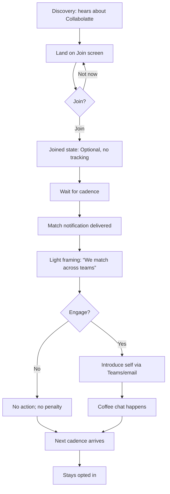
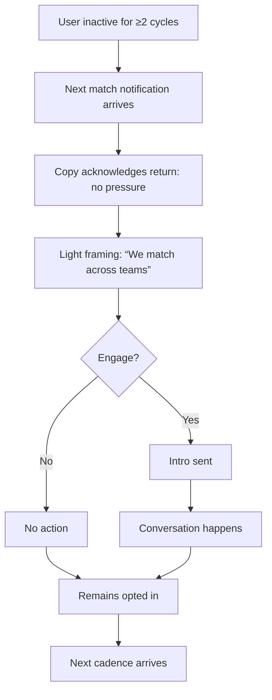

# UX Design Specification collabolatte

**Author:** DA9
**Date:** 2026-01-14 05:44

---

<!-- UX design content will be appended sequentially through collaborative workflow steps -->

## Executive Summary

### Project Vision
Collabolatte is a trust-first, opt-in ritual engine that makes it safe and effortless for two strangers inside the same organisation to accept a low-stakes invitation. The MVP is intentionally minimal: one programme, predictable cadence, random matching, and a gentle notification. Success is continued voluntary participation and occasional meaningful connections, not granular metrics.

### Target Users
- Cross-functional individual contributors who want low-effort discovery beyond their team without awkward outreach.
- New joiners (3-6 months in) building an internal map and safe contacts.
- Secondary: hybrid/remote staff whose weak ties decay fastest; sponsors who need a credible, non-surveillance narrative.

### Key Design Challenges
- Trust erosion: any hint of monitoring or hidden data use breaks adoption.
- Ghost town risk: matches feel optional but too easy to ignore; participation silently fades.
- First-move anxiety: users stall because outreach feels awkward or performative.
- Perceived effort: even small friction in join/leave/pause undermines the low-stakes promise.
- Cadence ambiguity: unclear timing makes the system feel random and untrustworthy.

### Design Opportunities
- Trust-first transparency as a core UX surface (plain language, no legalese).
- “Do nothing” friendly states that normalise pauses and missed cycles.
- First-move templates and gentle framing to reduce initiation anxiety.
- A cadence cue that is ever-present but low-pressure.
- Tone of voice that signals patience, not nudging.

## Executive Summary

### Project Vision
Collabolatte is a trust-first, opt-in ritual engine that makes it safe and effortless for two strangers inside the same organisation to accept a low-stakes invitation. The MVP is intentionally minimal: one programme, predictable cadence, random matching, and a gentle notification. Success is continued voluntary participation and occasional meaningful connections, not granular metrics.

### Target Users
- Cross-functional individual contributors who want low-effort discovery beyond their team without awkward outreach.
- New joiners (3-6 months in) building an internal map and safe contacts.
- Secondary: hybrid/remote staff whose weak ties decay fastest; sponsors who need a credible, non-surveillance narrative.

### Key Design Challenges
- Trust erosion: any hint of monitoring or hidden data use breaks adoption.
- Ghost town risk: matches feel optional but too easy to ignore; participation silently fades.
- First-move anxiety: users stall because outreach feels awkward or performative.
- Perceived effort: even small friction in join/leave/pause undermines the low-stakes promise.
- Cadence ambiguity: unclear timing makes the system feel random and untrustworthy.

### Design Opportunities
- Trust-first transparency as a core UX surface (plain language, no legalese).
- “Do nothing” friendly states that normalise pauses and missed cycles.
- First-move templates and gentle framing to reduce initiation anxiety.
- A cadence cue that is ever-present but low-pressure.
- Tone of voice that signals patience, not nudging.

## Core User Experience

### Defining Experience
The core experience is the match notification: users receive a match and decide almost instantly whether to engage or ignore it. The critical action to get right is the join moment — in a single glance, users must understand what will happen next, that expectations are minimal, and that non-response is a valid outcome. If the notification feels safe, clear, and low-pressure, everything else follows.

### Platform Strategy
MVP is web-only, surfaced primarily via Teams and email links. The primary interaction mode is mouse and keyboard. Expect corporate browsers, locked-down devices, and accessibility tools; avoid reliance on device-specific capabilities or offline modes.

### Effortless Interactions
- One-click join with immediate clarity on cadence and expectations.
- Zero-thought comprehension of the match notification and next step.
- Automatic cadence-based matching with avoidance of obvious repeat pairings.
- Explicitly neutral handling of non-response (no guilt, no reminders).
- Removal of unnecessary steps: no profile optimisation, no in-app scheduling, no feedback submission, no programme browsing.

### Critical Success Moments
- First-time join: user immediately understands the low-stakes, optional nature.
- First match notification: feels safe, clear, and easy to act on.
- First conversation (or graceful miss): no guilt, no obligation, no consequence.
- First-time success: user sees that nothing bad happens if they engage or ignore the match.

### Experience Principles
- Voluntariness first: invitation, not expectation, reinforced on every surface.
- Low effort is the trust proxy: no prep, no configuration, no follow-up required.
- Privacy reassurance is accessible but quiet: a short “what we store / don’t” link.
- The interface should recede; the conversation is the product.
- Notifications are the product: get the copy, tone, and timing right.

## Core User Experience

### Defining Experience
The core experience is the match notification: users receive a match and decide almost instantly whether to engage or ignore it. The critical action to get right is the join moment — in a single glance, users must understand what will happen next, that expectations are minimal, and that non-response is a valid outcome. If the notification feels safe, clear, and low-pressure, everything else follows.

### Platform Strategy
MVP is web-only, surfaced primarily via Teams and email links. The primary interaction mode is mouse and keyboard. Expect corporate browsers, locked-down devices, and accessibility tools; avoid reliance on device-specific capabilities or offline modes.

### Effortless Interactions
- One-click join with immediate clarity on cadence and expectations.
- Zero-thought comprehension of the match notification and next step.
- Automatic cadence-based matching with avoidance of obvious repeat pairings.
- Explicitly neutral handling of non-response (no guilt, no reminders).
- Removal of unnecessary steps: no profile optimisation, no in-app scheduling, no feedback submission, no programme browsing.

### Critical Success Moments
- First-time join: user immediately understands the low-stakes, optional nature.
- First match notification: feels safe, clear, and easy to act on.
- First conversation (or graceful miss): no guilt, no obligation, no consequence.
- First-time success: user sees that nothing bad happens if they engage or ignore the match.

### Experience Principles
- Voluntariness first: invitation, not expectation, reinforced on every surface.
- Low effort is the trust proxy: no prep, no configuration, no follow-up required.
- Privacy reassurance is accessible but quiet: a short “what we store / don’t” link.
- The interface should recede; the conversation is the product.
- Notifications are the product: get the copy, tone, and timing right.

## Desired Emotional Response

### Primary Emotional Goals
- Dominant emotion: relief — easy, optional, socially safe.
- Overall tone: calm, reassured, comfortable; a pressure-release valve, not a dopamine product.
- Differentiator: psychological safety without performance, tracking, or optimisation.

### Emotional Journey Mapping
- First discovery: reassurance, clarity, and a sense this won’t waste time.
- Core experience: low anxiety, clear expectations, shared responsibility (“we were both invited”).
- After completion: quiet satisfaction, mild confidence, no follow-up stress; a “that was fine” micro-moment.
- If something goes wrong: neutral, no guilt; calm transparency (“we missed this cycle, we’ll try again next cycle”).
- Returning later: familiarity, low stakes, trust that nothing has changed.

### Micro-Emotions
Optimise for:
- Confidence over confusion
- Trust over skepticism
- Low anxiety over excitement
- Satisfaction over delight
- Belonging over isolation

Explicitly avoid:
- Urgency
- Gamification
- Performance signalling
- “Programme energy”
- Any sense of being assessed

### Design Implications
- Make voluntariness explicit: opt-in, opt-out, and non-response are all valid outcomes.
- Keep tone low-key: calm, plain language that reduces social risk.
- Use predictable cadence cues as trust anchors (e.g., “Next match: on/around …”).
- Avoid UI patterns that imply measurement, optimisation, or evaluation.
- Treat failure as absorbed by the system: no guilt loops, no “missed match” messaging.
- Visuals should feel quiet: spacious layouts, soft contrast, no celebratory theatrics.

### Emotional Design Principles
- Relief first: every surface should reduce pressure and social risk.
- Calm over excitement: a quiet, steady experience is success.
- Safety without spectacle: trust cues, not trust theatrics.
- Predictability builds trust: stable tone and cadence every cycle.
- The interface recedes; the conversation remains.

## UX Pattern Analysis & Inspiration

### Inspiring Products Analysis
- Microsoft Teams (trusted utility): predictable behaviour, low surprise, fades into the background; notifications feel routine and ignorable without penalty.
- Calendly (social friction remover): carries the awkwardness of initiating; clear permission structure; one obvious next step.
- Google Search (zero ceremony): minimal UI, no onboarding theatre; you remember the result, not the product.

### Transferable UX Patterns
- Routine, non-urgent notifications with explicit permission to ignore.
- System-invitation framing that removes social risk.
- One unmistakable next action; no negotiation or configuration.
- Minimal UI that stays out of the way of the outcome.
- Background-utility posture: predictable, low-effort, low-attention.

### Anti-Patterns to Avoid
- Social network dynamics and performative identity cues.
- Productivity dashboards that imply evaluation or ranking.
- Engagement platforms with loud, celebratory UX.
- Usage-celebration patterns (badges, streaks, gamification).

### Design Inspiration Strategy
Adopt: “trust by boring” utility posture; routine notifications; low-cognitive-load surfaces.
Adapt: Calendly-style permission structure into match notifications; Google-style minimal UI into join flow.
Avoid: UX that celebrates usage or pressures engagement.
Risk to manage: over-boring; maintain clarity with a single obvious next action.

## Design System Foundation

### 1.1 Design System Choice
Adopt a themeable component system with strong defaults (MUI, Chakra, or Tailwind UI). Prioritise speed, accessibility, and restraint over visual expression.

### Rationale for Selection
- The product should disappear; visual uniqueness is not a success metric.
- Themeable systems provide a trustworthy baseline with minimal overhead.
- Fully custom systems invite bikeshedding and slow delivery.
- Heavy established systems (Material/Ant) are too opinionated and “app-like” for a low-key utility.
- Risk to manage: over-customising a themeable system until it behaves like a custom system.

### Implementation Approach
- Use stock components as-is; avoid “designing around” the system.
- Prefer layout and copy to express calmness over visual embellishment.
- No bespoke components unless reused in at least two distinct flows.

### Customization Strategy
- Minimal theming only: colour, spacing, typography.
- No custom variants unless a repeated UX pattern demands it.
- Keep a neutral internal-tool aesthetic (quiet, predictable, low-attention).

### Guardrails (to prevent drift)
- If a component draws attention to itself, it’s probably wrong.
- If a theme change requires custom CSS overrides, it’s likely too far.
- If a new component is single-use, don’t build it.

## 2. Core User Experience

### 2.1 Defining Experience
The defining experience is the match notification as a low-pressure invitation. Users receive a match, decide quickly whether to engage, and then either meet or move on. If the invitation feels safe, clear, and optional, everything else works. The success story users tell is simple: “I got matched with a couple of people and just had a coffee. It was easy.”

### 2.2 User Mental Model
Users currently solve this through ad-hoc intros, Teams outreach, or doing nothing to avoid awkwardness. Their default expectation is “another programme I’ll be expected to participate in.” Confusion centres on expectations, monitoring, preparation, and the consequences of ignoring a match. They love when the system carries the awkwardness; they hate obligation, forms, scheduling tools, follow-ups, and metrics.

### 2.3 Success Criteria
- Immediate comprehension: the engagement decision should take seconds.
- No initiation burden: they didn’t have to reach out first or explain.
- Silence is acceptable: no nags, no reminders, no judgement.
- Predictable cadence: the next match arrives on time.
- Automatic essentials: matching on cadence, clear human wording, avoidance of obvious repeats.

### 2.4 Novel UX Patterns
Established patterns only: opt-in subscription, notification-driven interaction, and link-out to a real-world meeting. The unique twist is what’s missing — no optimisation, no tracking, no performance framing.

### 2.5 Experience Mechanics
**Initiation (MVP):** user clicks “Join.” Nothing else required.
**Interaction:** user receives a message with who they’re matched with, why (briefly), and what to do next (optional).
**Feedback:** implicit; the system behaves the same whether they engage or ignore.
**Completion:** no “done” state — the conversation is the end, and staying opted-in is the success signal. The product fades back into the background.

**Post-MVP variation (programmes):** initiation expands to “Join a programme,” but principles stay fixed: invitation/recommendation first, a calm bulletin-board list second; one-click opt-in and opt-out; no comparison pressure, metrics, or optimisation cues. Adding programmes must not add pressure.

## Visual Design Foundation

### Color System
- **Base background:** #f6f5f2 (warm neutral)
- **Surface:** #ffffff
- **Borders:** #e6e4df (soft, consistent)
- **Primary text:** #1f2428
- **Secondary text:** #4f5b61
- **Muted surface:** #f0ede7
- **Chip background:** #f5f2ed
- **Primary accent (actions):** #3a7f6c
- **Accent border:** #5d9a89
- **Secondary action accent:** #6a9486
- **Focus outline:** #7ea99a

**Semantics:**
- Primary action uses sage accent; secondary actions use muted sage.
- Avoid urgency colours or celebratory states.
- Default to neutral, low-attention surfaces.

### Typography System
- **Base size:** 14px (minimum) with 1.6 line height.
- **Body weight:** regular; avoid light weights for readability.
- **Headings:** understated scale, small jumps in size to keep hierarchy calm.
- **Tone:** plain, quiet, and predictable.

### Spacing & Layout Foundation
- **Layout feel:** airy, low-density, easy to scan.
- **Spacing unit:** 8px base rhythm (multiples for consistency).
- **Component spacing:** generous padding to reduce cognitive load.
- **Depth:** minimal; avoid heavy shadows and layered effects.

### Accessibility Considerations
- WCAG 2.1 AA contrast for body/secondary text, buttons, and key UI surfaces.
- Focus states visible via outline + offset; no colour-only indicators.
- Click targets large enough for imperfect motor control.
- No essential meaning conveyed by animation; respect reduced-motion preferences.
- Plain English microcopy; consistent cues: optional, no obligation, easy to skip.

### Implementation Notes
- Keep tokens stable to minimise engineering churn.
- Avoid CSS overrides that fight the design system defaults.
- Maintain a single visual “voice”; no hero treatments or attention-seeking components.

## Design Direction Decision

### Design Directions Explored
Six calm directions were explored using Theme A: single-screen match focus, quiet context add-on, MVP programme card, MVP card with post-MVP placeholder, two-panel layout, and minimal join-first entry.

### Chosen Direction
**Direction 1 — Single-Screen Calm** is the core product experience. **Direction 2 — Quiet Context** is a secondary, subdued block that answers “what happens next” without competing with the match. **Direction 6 — Minimal Join-First** is the first-time entry screen only. **Direction 3 — MVP Programme Card** is a secondary status view. **Direction 5** is deferred; **Direction 4** is hidden from MVP UI.

### Design Rationale
- The match notification is the product; Direction 1 keeps it central and low-noise.
- Quiet context reduces anxiety without adding a second goal.
- Entry should be minimal; joined users should see the match surface immediately.
- Programme thinking increases cognitive load; it stays secondary or post-MVP.

### Implementation Approach
- Base layout: Direction 1.
- Add Direction 2’s “What happens next” as a soft, collapsible or secondary block.
- Use Direction 6 for first-time join only.
- Keep Direction 3 as a low-key status view.
- Rename any KPI-like blocks to neutral labels (e.g., “Next match”).
- Keep chips consistent across screens; keep Skip/Later placement stable.
- No iconography yet; text carries the meaning.

## User Journey Flows

### Journey 1: New Joiner — First Coffee Match (Tomás)
**Goal:** Join with minimal effort, receive first match, understand no-pressure expectations.



**Success Criteria:** Instant comprehension, safe invitation, no-penalty skip, predictable cadence.

### Journey 2: Sceptic — Tests the Waters (Marcus)
**Goal:** Validate trust and low-obligation framing; avoid churn.

```mermaid
graph TD
  A[Discovery: hears about Collabolatte] --> B[Join screen with reassurance]
  B --> C{Join?}
  C -->|Join| D[Joined: no tracking, optional]
  C -->|Not now| B
  D --> E[Match notification]
  E --> F[Light framing: “We match across teams”]
  F --> G{Feels pressured?}
  G -->|No| H[Optional intro sent]
  G -->|Yes| I[Ignore / opt-out]
  H --> J[Conversation happens]
  I --> K[Exit quietly (one click)]
  J --> L[Next cadence arrives]
  L --> M[Stays opted in]
```

**Success Criteria:** Zero obligation signals; easy opt-out; optional action feels safe; explicit “ignoring has no consequences.”

### Journey 3: Dormant User — Returns After Inactivity
**Goal:** Re-engage without guilt or re-onboarding.



**Success Criteria:** Neutral tone, no guilt, easy return, continuity without re-setup.

### Journey Patterns
- **Invitation-first:** All journeys begin with a low-pressure invite.
- **Silence is valid:** Non-response is an explicit path with no penalty.
- **Predictable cadence:** Time-based rhythm is the stability anchor.
- **Single-step actions:** Join, Introduce, Skip; no multi-step flows.

### Flow Optimization Principles
- Minimise decision points and keep copy consistent.
- Avoid reminders that imply obligation.
- Use the same “optional/no tracking” reassurance in every journey.
- Keep outcomes invisible; the system does not ask for feedback.
- **Operational note:** if a notification fails, recover silently on the next cadence.

## Component Strategy

### Design System Components
**Selected system:** MUI (Material UI)

Use default MUI components with minimal styling (spacing, borders, typography). No bespoke component library for MVP.

**Primary components:**
- Match notification: `Card` + `CardContent` + `CardActions`
- Chips: `Chip` (outlined or subtle filled variant)
- “What happens next” block: `Paper` with heading, or neutral `Alert`
- Join screen panel: `Paper` or `Card`
- Next match info: `Typography` + `Divider` inside `Paper`

### Custom Components
None required for MVP. Optional tiny wrappers only if reused more than once:
- Consistent card spacing wrapper
- Consistent chip group layout

### Component Implementation Strategy
- Theme MUI fully (typography scale, border radius, spacing, Sage Calm palette).
- Keep layout minimal: one dominant card, generous whitespace, no navigation in MVP.
- Use microcopy as the differentiator; avoid enterprise jargon.
- Do not override MUI into a new system; restraint is the product.

### Implementation Roadmap
**Phase 1 — Core:** Match card, join panel, chips, next-match block, neutral context block.
**Phase 2 — Supporting:** Optional wrappers for spacing/consistency if reused.
**Phase 3 — Post‑MVP:** Programme list card patterns (invitation‑first, no metrics).

### Accessibility & Interaction Rules
- Visible `:focus-visible` on all interactive elements; no hover-only affordances.
- No colour-only signalling; text must carry meaning.
- Explicit verb labels on buttons.
- Respect reduced-motion; no animation-dependent meaning.
- Avoid disabled-as-default; hide or explain unavailable actions.

### Uniqueness Without Custom Components
- Unique tone through copy, spacing, and restraint.
- Signature patterns: match card layout, calm “what happens next” block, consistent optional action styling.
- Minimal illustration usage (sparingly, one per screen max).

## UX Consistency Patterns

### Button Hierarchy
- One clear primary action per screen.
- Secondary actions (Skip/Later/Leave) are always visible and safe.
- Never hide or de-emphasise the optional path.
- Labels are explicit verbs; avoid vague actions.

### Feedback Patterns
- No celebratory success states; keep outcomes quiet.
- Errors explain what happened and what did not happen, with next step.
- Info messages are neutral and reassuring, not alarmist.

### Empty & Loading States
- Empty states explain why nothing is happening and when it will.
- Loading states are brief, honest, and calm.
- Silence is acceptable; confusion is not.

### Navigation Patterns
- Minimal navigation; no persistent side nav.
- Clear “where am I” without deep hierarchy.
- Default to single-screen flows.

### Modal / Overlay Patterns
- Use sparingly; only for true confirmations or essential explanations.
- Avoid interrupting users unless necessary.

### Additional Patterns
- Forms: minimal presence; validation is forgiving and explanatory.
- Search/Filter: intentionally absent in MVP to avoid optimisation pressure.

**Guiding Principle:** If a pattern introduces urgency, choice anxiety, or performance cues, it is the wrong pattern. If it makes it obvious that nothing bad will happen, it is the right one.

## Responsive Design & Accessibility

### Responsive Strategy
- Desktop-first build; mobile-safe by design for the core loop.
- Desktop is the primary working surface; mobile is a first-class consumption surface for match notifications.
- Mobile: single-column layouts; no two-panel layouts below tablet.
- Primary CTA visible without scrolling where possible.
- Secondary content collapsible on mobile (e.g., “What happens next”).
- Enforce copy length/truncation rules to preserve CTA visibility on small screens.

### Breakpoint Strategy
- **360px** small mobile (minimum supported)
- **768px** tablet
- **1024px** small laptop
- **1280px** desktop

### Accessibility Strategy
- WCAG 2.1 AA.
- Sufficient contrast without brightening the UI.
- Clear `:focus-visible` states.
- Keyboard-first navigation across all screens.
- No colour-only meaning; text carries semantics.
- Plain English, short sentences, no idioms.

### Testing Strategy
**Automated**
- Playwright for E2E journeys and trust-critical flows (join, match view, skip).
- Playwright MCP to replay key journeys and guard tone/interaction.
- Axe-core (or equivalent) integrated in Playwright for accessibility checks.
- Explicit 360px viewport tests for CTA visibility and spacing.
- Avoid brittle visual diffs unless they add clear value.

**Manual**
- Keyboard-only walkthroughs of critical journeys.
- Screen reader spot-checks on join and match screens.
- Visual contrast checks for primary surfaces and actions.

**Mobile Testing**
- Playwright at mobile viewport for join, match view, act/skip flow, and “what we store” page.

### Implementation Guidelines
- Respect reduced-motion preferences.
- Ensure comfortable touch targets and spacing between primary/secondary actions.
- Keep match-link screen calm, readable, and low-effort.
- Keep assets and bundles lightweight for managed corporate environments.
- Tests assert behaviour and intent; flaky tests are fixed or removed.

