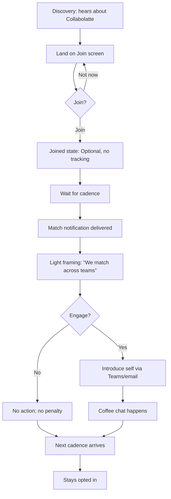

# User Journey Flows

## Journey 1: New Joiner — First Coffee Match (Tomás)
**Goal:** Join with minimal effort, receive first match, understand no-pressure expectations.



**Success Criteria:** Instant comprehension, safe invitation, no-penalty skip, predictable cadence.

## Journey 2: Sceptic — Tests the Waters (Marcus)
**Goal:** Validate trust and low-obligation framing; avoid churn.

```mermaid
graph TD
  A[Discovery: hears about Collabolatte] --> B[Join screen with reassurance]
  B --> C{Join?}
  C -->|Join| D[Joined: no tracking, optional]
  C -->|Not now| B
  D --> E[Match notification]
  E --> F[Light framing: “We match across teams”]
  F --> G{Feels pressured?}
  G -->|No| H[Optional intro sent]
  G -->|Yes| I[Ignore / opt-out]
  H --> J[Conversation happens]
  I --> K[Exit quietly (one click)]
  J --> L[Next cadence arrives]
  L --> M[Stays opted in]
```

**Success Criteria:** Zero obligation signals; easy opt-out; optional action feels safe; explicit “ignoring has no consequences.”

## Journey 3: Dormant User — Returns After Inactivity
**Goal:** Re-engage without guilt or re-onboarding.


**Success Criteria:** Neutral tone, no guilt, easy return, continuity without re-setup.

## Journey Patterns
- **Invitation-first:** All journeys begin with a low-pressure invite.
- **Silence is valid:** Non-response is an explicit path with no penalty.
- **Predictable cadence:** Time-based rhythm is the stability anchor.
- **Single-step actions:** Join, Introduce, Skip; no multi-step flows.

## Flow Optimization Principles
- Minimise decision points and keep copy consistent.
- Avoid reminders that imply obligation.
- Use the same “optional/no tracking” reassurance in every journey.
- Keep outcomes invisible; the system does not ask for feedback.
- **Operational note:** if a notification fails, recover silently on the next cadence.
